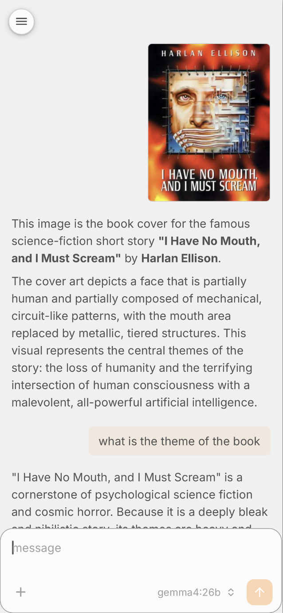

# royale with chat

<p>
  
  
</p>

Minimal, self-hosted chat UI for an Ollama endpoint on the LAN. Sibling project
to [halo](../hcc) — same design tokens, different glyph, same warm orange dot.

- Streaming token-by-token responses (SSE)
- Per-user conversation history in SQLite (kanidm OIDC; dev fallback for local work)
- Configurable retention (default 30 days)
- New chat / list with swipe-to-delete
- No navbars, no chrome — just the conversation

## Stack

| Layer | Tech |
|---|---|
| Backend | Rust, actix-web 4, actix-web-lab SSE, reqwest stream → Ollama NDJSON, rusqlite (bundled), actix-session cookie store |
| Frontend | Vite + React 19, Emotion theme (copied from halo), TanStack Router (file-based), SWR |
| Auth | OIDC (kanidm) — code + PKCE flow with cookie session. Dev fallback via `DEV_AUTH=1`. |
| Persistence | SQLite (`chat.db` by default), schema bootstrapped on startup |

## Layout

```
chat/
├── backend/         actix-web server, SSE proxy, SQLite, auth
├── frontend/        React SPA (Vite)
├── .claude/skills/  chat-design — design system + brand guidelines
└── README.md
```

## Quick start

Two terminals.

**Backend**

```sh
cd backend
cp .env.example .env             # edit OLLAMA_URL etc.
cargo run
```

**Frontend**

```sh
cd frontend
yarn install
yarn dev
```

Then open http://localhost:5173. Vite proxies `/api`, `/auth`, `/status` to
the backend on `:8080`.

**Git hooks** (one-time, per clone):

```sh
./install-hooks.sh
```

This points `core.hooksPath` at `.githooks/`. The pre-commit hook runs
`yarn lint` + `yarn format` for staged frontend changes and `cargo clippy
-- -D warnings` for staged backend changes.

In dev mode (`DEV_AUTH=1`), hitting "sign in" calls `/auth/login` which writes
a cookie session for user `dev`. Override with `?username=foo` for multiple
users on one box.

## Configuration

See `backend/.env.example` for the full list. Key values:

| Var | Default | Purpose |
|---|---|---|
| `OLLAMA_URL` | `http://localhost:11434` | Upstream Ollama HTTP endpoint |
| `OLLAMA_MODEL` | unset | If set, locks all chats to this model and ignores client selection |
| `CHAT_TTL_DAYS` | `30` | Conversations older than this are purged hourly |
| `CHAT_DB_PATH` | `chat.db` | SQLite file (relative to backend cwd) |
| `SESSION_KEY` | _ephemeral_ | 64-byte hex; generate with `openssl rand -hex 64`. Sessions invalidate on restart if unset. |
| `DEV_AUTH` | `0` | When `1`, `/auth/login` writes a session without OIDC |
| `OIDC_ISSUER` | unset | Kanidm OIDC issuer URL, e.g. `https://kanidm.lan/oauth2/openid/chat` |
| `OIDC_CLIENT_ID` | unset | OIDC client id registered in kanidm |
| `OIDC_CLIENT_SECRET` | unset | OIDC client secret |
| `OIDC_REDIRECT_URL` | unset | Public callback URL, e.g. `https://chat.lan/auth/callback` |

## API

```
GET    /status                         { upstream, model_locked, auth }
GET    /auth/login                     start auth (dev: writes session; oidc: redirect)
GET    /auth/callback                  oidc callback (validates state + nonce + id_token)
POST   /auth/logout                    clear session

GET    /api/me                         { sub, username } or 401
GET    /api/models                     proxy of /api/tags (or { locked: true })

GET    /api/conversations              list user's conversations
POST   /api/conversations              { title?, model? } → Conversation
DELETE /api/conversations/{id}
GET    /api/conversations/{id}/messages

POST   /api/chat                       { conv_id, content, model? } → SSE stream
                                       events: delta (string), done ({conv_id}), error
```

## Design system

The `chat-design` skill in `.claude/skills/chat-design/` is the source of
truth for visual language. Run `/chat-design` from inside Claude Code to load
it, or read `.claude/skills/chat-design/SKILL.md` directly.

The chat app reuses the halo theme verbatim (`frontend/src/themes.ts`) so
both apps render identical colors, fonts, and shadow tokens. Only the
wordmark glyph differs: chat bubble + accent dot vs. ring + accent dot.

## CI

GitHub Actions in `.github/workflows/`:

- `ci.yaml` — frontend (lint, format, typecheck, build) + backend (clippy
  with `-D warnings`, test, build) on push/PR to `develop`.
- `automerge.yaml` — auto-merges Dependabot PRs that pass CI.
- `dependabot.yaml` — weekly updates for npm, cargo, and github-actions,
  with React, TanStack, and markdown deps grouped to keep PR noise low.

## Roadmap / TODO

- [ ] Deferred renderer extras (mermaid, code-copy, streaming fence
  balancer) — see `.claude/skills/chat-design/README.md` →
  "Future renderer extensions"
- [ ] File ingestion / RAG for PDFs and docs — see same doc, two-tier
  plan (naive injection vs. embed+retrieve via `sqlite-vec`)
